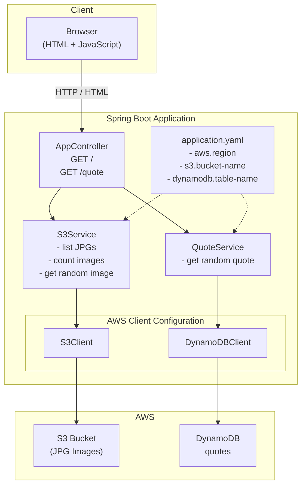

# Software

# Software

The system is based on [spring initializr](https://start.spring.io/). Added dependencies can be found in [pom.xml](https://github.com/thb-cc/app/blob/main/pom.xml)

```mermaid
flowchart TB

    %% Client
    subgraph Client["Client"]
        Browser["Browser<br/>(HTML + JavaScript)"]
    end

    %% Spring Boot Application
    subgraph App["Spring Boot Application"]

        %% Controller
        AppController["AppController<br/>GET /<br/>GET /quote"]

        %% Services
        S3Service["S3Service<br/>- list JPGs<br/>- count images<br/>- get random image"]
        QuoteService["QuoteService<br/>- get random quote"]

        %% Configuration
        AppYaml["application.yaml<br/>- aws.region<br/>- s3.bucket-name<br/>- dynamodb.table-name"]

        %% AWS Client Config
        subgraph AWSConfig["AWS Client Configuration"]
            S3Client["S3Client"]
            DynamoDBClient["DynamoDBClient"]
        end

        %% Wiring inside app
        AppController --> S3Service
        AppController --> QuoteService

        S3Service --> S3Client
        QuoteService --> DynamoDBClient

        AppYaml -.-> S3Service
        AppYaml -.-> QuoteService
    end

    %% =====================
    %% AWS Resources
    %% =====================
    subgraph AWS["AWS"]
        S3Bucket["S3 Bucket<br/>(JPG Images)"]
        DynamoTable["DynamoDB <br/>quotes"]
    end

    %% =====================
    %% Cross-System Connections
    %% =====================
    Browser -->|HTTP / HTML| AppController

    S3Client --> S3Bucket
    DynamoDBClient --> DynamoTable


```