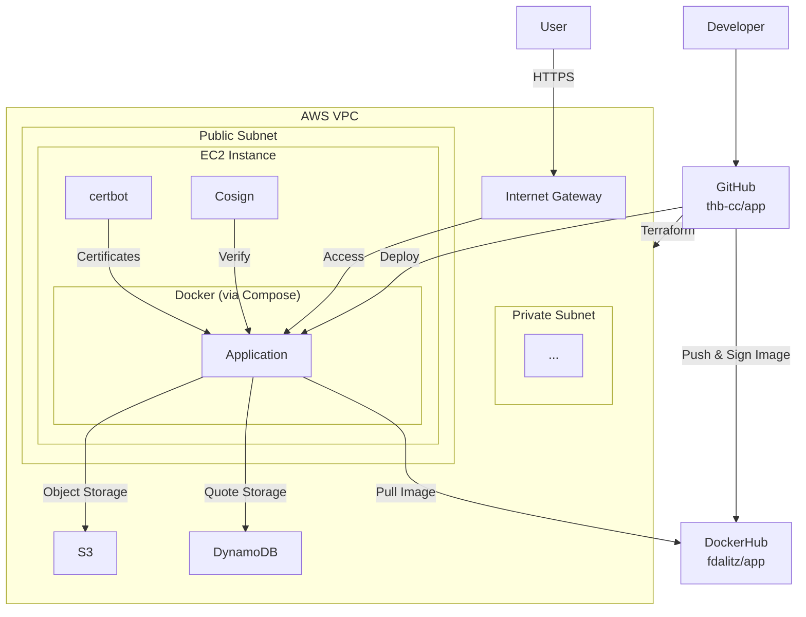

# System

The system infrastructure is based on [Amazon AWS](https://aws.amazon.com/) and managed with [Terraform](https://developer.hashicorp.com/terraform) and our [main.tf](https://github.com/thb-cc/app/blob/main/main.tf) file.
The Terraform state is maintained by manually executing `terraform apply` locally, since our AWS access is based on [AWS Academy](https://aws.amazon.com/training/awsacademy/) and thus the credentials change every lab session.
State consistency is achieved by storing the [.terraform.lock.hcl](https://github.com/thb-cc/app/blob/main/.terraform.lock.hcl) file in our repository.

The private subnet is prepared for future use but is not actively utilized yet.
