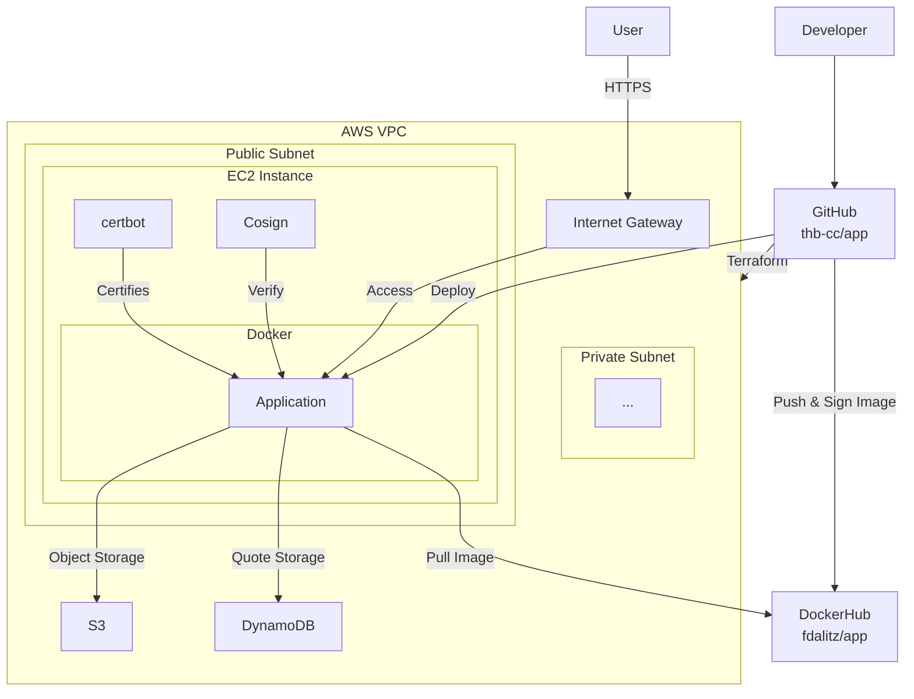

# Architecture

The build and deployment of `thb-cc/app` is handled by the [deploy](https://github.com/thb-cc/app/blob/main/.github/workflows/deploy.yaml) workflow using GitHub actions.

The infrastructure is based on [Amazon AWS](https://aws.amazon.com/) and managed via [Terraform](https://developer.hashicorp.com/terraform) using our [main.tf](https://github.com/thb-cc/app/blob/main/main.tf) file.
The Terraform state is maintained by manually/locally executing commands, since our AWS access is based on [AWS Academy](https://aws.amazon.com/training/awsacademy/) and thus the credentials change every lab session.
State consistency is achieved by storing the [.terraform.lock.hcl](https://github.com/thb-cc/app/blob/main/.terraform.lock.hcl) file.

A private subnet is prepared for future use but is not actively utilized yet.

